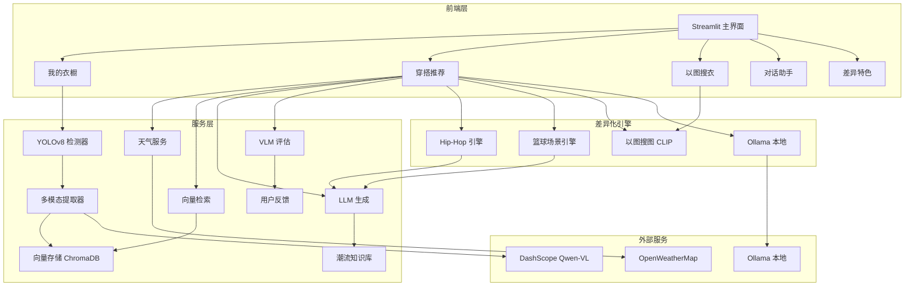
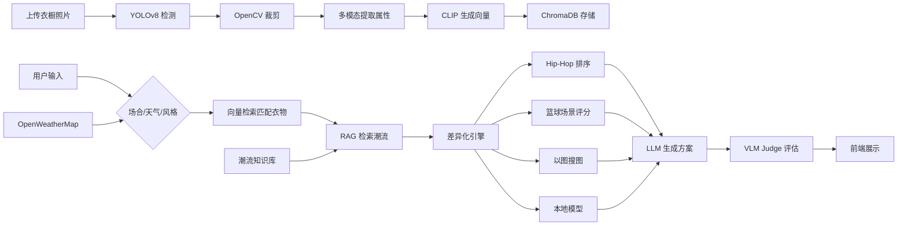

# 👕 穿搭灵感助手

结合"说唱+穿搭+篮球"个人背景的多模态穿搭灵感助手。上传衣橱照片，系统自动识别衣物、结合天气和场合，生成个性化穿搭方案。

> 这不是一个通用穿搭助手，而是一个"懂你"的助手：把 Hip-Hop 审美、篮球场景需求、潮流趋势和本地化隐私保护同时融入系统设计。

---

## ✨ 核心功能

### 阶段一：MVP 基础功能
- 📸 **衣橱数字化**：上传照片 → YOLOv8 检测 → 裁剪 → 多模态模型提取结构化属性
- 🧠 **向量存储**：CLIP Embedding + ChromaDB，支持相似衣物检索
- 🌤️ **天气感知**：接入 OpenWeatherMap，温度/体感温度自动注入推荐
- 💬 **对话交互**：自然语言问答，结合衣橱和天气上下文

### 阶段二：天气与场景整合
- 🌡️ **智能天气服务**：带缓存和降级机制的天气 API
- 🎯 **场景化推荐**：10+ 场合预设（面试/约会/打球/录音棚/上课等）
- 🏀 **篮球专项**：针对打球场景优化运动风格推荐
- ⚡ **实时数据**：温度、湿度、风速综合考量

### 阶段三：潮流趋势与 RAG 增强
- 📈 **潮流知识库**：ChromaDB 存储穿搭博主内容
- 🔍 **RAG 检索**：根据场合和风格检索相关潮流信息
- 💡 **智能注入**：潮流趋势自动融入穿搭方案生成

### 阶段四：优化与评估
- ⭐ **VLM Judge 评估**：设计感、合身度、协调性三维评分
- 📊 **检索效果评估**：Precision@K 和 MAP 指标
- 👍 **用户反馈机制**：点赞/踩记录，持续优化 Prompt
- 🎤 **Hip-Hop Style 专属模式**：Oversize + 大胆配色 + 球鞋配饰

---

## 🏗️ 系统架构



---

## 🛠️ 技术栈

| 模块 | 技术 | 说明 |
|------|------|------|
| 前端 | Streamlit | 快速搭建、支持图片上传和对话组件 |
| 衣物检测 | YOLOv8 | 轻量级目标检测 |
| 属性提取 | Qwen-VL-Max / Gemma | 多模态模型提取衣物属性 |
| 向量检索 | CLIP + ChromaDB | 图文向量化与相似检索 |
| 天气数据 | OpenWeatherMap API | 实时天气数据 |
| 大语言模型 | DeepSeek / Qwen2.0 | 生成穿搭方案 |
| 评估模型 | VLM | 穿搭质量评估 |

---

## 🎯 为什么这个项目有差异化？

### 1. 🎤 Hip-Hop Style 专属模式
- **不是**简单加个风格标签，而是从 Prompt、权重排序、场景判断三层定制
- 自动识别并优先推荐 Oversize / Baggy / 街头元素
- 内置关键词权重：Oversize +3、宽松 +3、街头 +2、棒球服 +2
- 自动规避修身、商务、正装类单品

### 2. 🏀 篮球场景专项
- 内置球鞋型号库：GT Cut、Harden、Jordan、Kyrie、Curry 等
- 装备评分机制：篮球鞋 +10、速干上衣 +5、运动配件 +3
- 选择「打球」场合自动激活篮球 Prompt 和穿搭贴士

### 3. 🔍 以图搜衣
- CLIP 将穿搭参考图编码为向量
- ChromaDB 按余弦相似度检索衣橱中相似单品
- 支持上传任意穿搭照片，直观找到替代组合

### 4. 🖥️ 本地部署
- Ollama + 4B 小模型本地运行
- 衣物照片不上传云端，解决隐私顾虑
- 侧边栏一键切换云端/本地模式

---

## 📦 项目结构

```
Outfit Inspiration Assistant/
├── app/
│   ├── main.py                      # Streamlit 主入口（5页面）
│   ├── config.py                    # 配置管理
│   ├── utils/
│   │   ├── schema.py                # 数据结构定义
│   │   └── image.py                 # 图像工具
│   ├── wardrobe/
│   │   ├── detector.py              # YOLOv8 检测
│   │   ├── extractor.py             # 属性提取
│   │   └── storage.py               # 向量存储
│   ├── recommend/
│   │   ├── weather.py               # 天气服务
│   │   ├── retriever.py             # 向量检索
│   │   ├── generator.py             # 方案生成
│   │   ├── evaluator.py             # VLM 评估
│   │   ├── feedback.py              # 用户反馈
│   │   └── pipeline.py              # 推荐流水线（差异化整合）
│   ├── rag/
│   │   ├── knowledge_base.py        # 潮流知识库
│   │   ├── retriever.py             # RAG 检索
│   │   └── prompt.py                # Prompt 模板
│   ├── styles/
│   │   ├── hiphop.py                # Hip-Hop 引擎
│   │   ├── basketball.py            # 篮球场景引擎
│   │   └── image_search.py          # 以图搜图
│   └── local/
│       └── ollama.py                # 本地部署
├── requirements.txt
├── run.py
└── .env.example
```

---

## 🚀 快速开始

### 1. 克隆项目

```bash
git clone https://github.com/XieYuxiang30/Outfit-Inspiration-Assistant.git
cd Outfit-Inspiration-Assistant
```

### 2. 安装依赖

```powershell
pip install -r requirements.txt
```

### 3. 配置 API Key

复制 `.env.example` 为 `.env`，填入你的 API Key：

```env
# 多模态模型（用于衣物属性提取）
MULTIMODAL_API_KEY=your_key
MULTIMODAL_BASE_URL=https://dashscope.aliyuncs.com/compatible-mode/v1
MULTIMODAL_MODEL=qwen-vl-max

# 大语言模型（用于生成穿搭方案）
LLM_API_KEY=your_key
LLM_BASE_URL=https://dashscope.aliyuncs.com/compatible-mode/v1
LLM_MODEL=qwen-turbo

# 天气 API
OPENWEATHER_API_KEY=your_key
```

> **推荐**：使用阿里云 DashScope 免费额度，支持 Qwen-VL-Max 和 Qwen-Turbo。

### 4. 启动项目

```powershell
python run.py
# 或
streamlit run app/main.py
```

浏览器会自动打开 `http://localhost:8501`

---

## 📖 使用指南

### 1. 上传衣橱照片
进入「我的衣橱」页面，上传包含多件衣物的照片，点击「开始识别衣物」。系统会自动：
- 使用 YOLOv8 检测衣物区域
- 裁剪每件衣物
- 调用多模态模型提取属性（类型、颜色、材质等）
- 存入 ChromaDB 向量数据库

### 2. 获取天气信息
进入「穿搭推荐」页面，输入城市名称，点击「获取天气」。系统会显示：
- 当前温度
- 体感温度
- 天气描述
- 湿度、风速

### 3. 生成穿搭方案
- 选择场合（如「打球」「面试」）
- 输入风格偏好（如「Oversize」「街头风」）
- 点击「生成穿搭方案」
- 系统会：
  1. 从衣橱检索匹配衣物
  2. RAG 检索潮流趋势
  3. LLM 生成 3 套方案
  4. VLM Judge 评估打分

### 4. Hip-Hop Style 模式
在「穿搭推荐」页面开启 Hip-Hop Mode：
- 自动推荐 Oversize 版型
- 大胆配色方案
- 球鞋 + 配饰组合
- 街头风格优先

### 5. 以图搜衣
进入「以图搜衣」页面：
- 上传一张喜欢的穿搭照片
- 系统从衣橱中找到风格相近的单品
- 基于 CLIP 多模态相似检索

### 6. 本地部署
1. 安装 Ollama: https://ollama.com
2. 拉取模型: `ollama pull qwen2.5:4b`
3. 启动 Ollama 服务
4. 在侧边栏勾选「使用 Ollama 本地模型」

### 7. 提供反馈
对生成的方案可以点赞/踩，系统会记录反馈用于持续优化。

---

## 🔧 开发说明

### 环境要求
- Python 3.8+
- pip / conda

### 运行测试

```powershell
# 检查代码规范
pip install flake8
flake8 app/

# 运行（需要配置 API Key）
streamlit run app/main.py
```

### 扩展开发

#### 添加新的潮流数据源

```python
from app.rag.knowledge_base import TrendKnowledgeBase

kb = TrendKnowledgeBase()
kb.add_trend(
    content="2024年流行趋势内容",
    source="小红书/Instagram",
    metadata={"type": "trend", "season": "秋季"}
)
```

#### 自定义 Prompt

编辑 `app/rag/prompt.py`：

```python
class PromptTemplate:
    @staticmethod
    def custom_recommendation(query, garments, trends):
        return f"你的自定义 Prompt..."
```

#### 添加新的评估维度

编辑 `app/recommend/evaluator.py`：

```python
def evaluate(self, outfit, weather, occasion):
    # 添加新的评分维度
    return {
        "design_score": ...,
        "fitness_score": ...,
        "your_new_score": ...,
    }
```

---

## 📊 数据流图



---

## 📝 后续计划

- [ ] 训练专用衣物检测模型（提升检测准确率）
- [ ] 接入小红书/Instagram 爬虫，自动更新潮流知识库
- [ ] 支持以图搜图（上传穿搭照片，从衣橱找相似单品）
- [ ] 增加用户系统，云端同步衣橱
- [ ] 移动端适配
- [ ] 社交分享功能

---

## 🤝 贡献

欢迎提交 Issue 和 Pull Request！

## 📄 License

MIT License

---

**注意**：本项目为 Demo 展示，生产环境使用需要：
- 替换默认 API Key 为生产密钥
- 加强输入验证和错误处理
- 添加用户认证和授权
- 优化向量数据库索引性能
